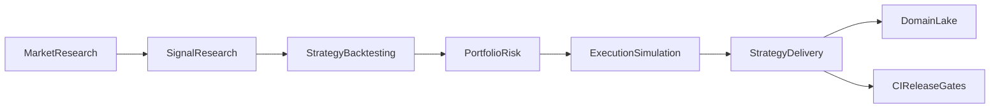

# Finance — Automated Trading R&D

**Finance** quant inference environment: market scenarios, signals, backtests, execution simulation, risk, and paper-trading delivery gates through **develop → validate → package → operate**. Broker-ready architecture; **paper trading only** in this release.

## Trading lifecycle

| Stage | Subdomain | Purpose |
|-------|-----------|---------|
| Research | `market_research` | Scenarios, liquidity regimes, microstructure features |
| Research | `signal_research` | Alpha decay, stat-arb spread signals |
| Develop | `strategy_backtesting` | Sharpe, hit rate, drawdown validation gates |
| Integrate | `execution_simulation` | Slippage, impact, paper-order fill simulation |
| Risk | `portfolio_risk` | Drawdown envelopes, VaR proxies, mean-variance allocation |
| Deliver | `strategy_delivery` | Release readiness and paper-deployment gates |

## Model catalog

| Subdomain | Model | Kind | Key outputs |
|-----------|-------|------|-------------|
| `market_research` | `market_scenario_research` | forecast + trading metrics | `liquidity_score`, `regime_volatility` |
| `market_research` | `liquidity_regime_forecast` | forecast + trading metrics | regime-aware liquidity |
| `signal_research` | `spread_signal_research` | forecast + trading metrics | `signal_score`, `expected_return` |
| `signal_research` | `alpha_decay_signal` | forecast + trading metrics | `half_life_bars` |
| `strategy_backtesting` | `strategy_backtest_validation` | forecast + trading metrics | `sharpe_ratio`, `hit_rate`, `max_drawdown` |
| `strategy_backtesting` | `sharpe_ratio_backtest` | forecast + trading metrics | benchmark-relative Sharpe gate |
| `execution_simulation` | `execution_slippage_sim` | forecast + trading metrics | `slippage_bps`, `fill_rate` |
| `execution_simulation` | `paper_order_fill_sim` | forecast + trading metrics | paper fill quality |
| `portfolio_risk` | `drawdown_envelope_risk` | forecast + trading metrics | `max_drawdown`, `var_proxy` |
| `portfolio_risk` | `portfolio_risk_envelope` | forecast + trading metrics | risk envelope utilization |
| `portfolio_risk` | `portfolio_allocation_optimizer` | solver | optimal weights, Sharpe |
| `strategy_delivery` | `strategy_release_readiness` | forecast + trading metrics | `readiness_score`, `gate_passed` |
| `strategy_delivery` | `paper_trading_delivery_gate` | forecast + trading metrics | paper release candidate |

Central code: `src/khukra/domains/finance/` (`trading_base.py`, per-stage modules).

## Platform hooks

| Layer | Location |
|-------|----------|
| Registry | `src/khukra/domains/registry.py` |
| Manifest | `src/khukra/domains/meta.py` (`DOMAIN_MANIFESTS["finance"]` v2.0.0) |
| Inference | `src/khukra/inference/registry.py` (`trading_*` predictor types) |
| MLOps templates | `quant_research_loop`, `strategy_backtest_gate`, `paper_trading_delivery` |
| Lake | `/api/v1/domains/finance/lake/*` |
| UI | `/d/finance/*` domain shell |

## MLOps pipelines

1. **`quant_research_loop`** — market scenario generation → signal research artifact (`/api/v1/workflows/generate`).
2. **`strategy_backtest_gate`** — backtest validation with Sharpe/drawdown thresholds (`/api/platform/mlops/pipeline`).
3. **`paper_trading_delivery`** — execution simulation → paper release candidate with readiness gate.

## Lake families

| `family_id` | Space | Content |
|-------------|-------|---------|
| `finance.market_scenarios` | research | Synthetic market and liquidity scenarios |
| `finance.signal_eval` | research / development | Signal and backtest validation exports |
| `finance.execution_risk` | research | Execution simulation traces |
| `finance.portfolio_risk` | research | Risk envelopes and allocation outputs |
| `finance.strategy_releases` | development | Paper-trading release candidates |

## Out of scope (this release)

- Live broker connectivity, order routing, and capital deployment
- Regulatory reporting and sub-millisecond execution SLOs
- Production secrets for market-data vendors

## Related docs

- [Domain lake architecture](./domain-lake-architecture.md)
- [Roadmap](./roadmap.md)
- [Versioning](./versioning.md)
