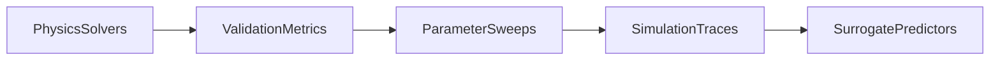

# Physical Systems — Physics Solvers

**Physical** domain environment for simulation-first workloads: governing equations, numerical solvers, validation gates, parameter sweeps, and surrogate-ready outputs on the domain data plane. Default UI: Domain Cockpit (`/d/physical/workflows`).

## Solver catalog

| Subdomain | Model | Kind | Science |
|-----------|-------|------|---------|
| `mechanics` | `cantilever_beam` | `solver` | Euler-Bernoulli beam under uniform load |
| `mechanics` | `damped_oscillator` | `dynamic_simulation` | Mass-spring-damper ODE |
| `thermofluid` | `counterflow_heat_exchanger` | `solver` | Lumped NTU counterflow heat exchanger |
| `dynamics` | `point_mass_2d` | `dynamic_simulation` | 2D point mass with force, drag, gravity |

Central metadata: `src/khukra/domains/physical/models_registry.py` (`SolverSpec`, `model_kind`, inference schemas).

## Scientific outputs

Each solver run returns:

- **metrics** — scalar engineering quantities (deflection, energy, NTU, displacement, etc.)
- **series** — time or spatial traces for sweeps and surrogates
- **metadata** — `solver_spec` (equations, assumptions, parameters, variables) and `numerical_status` for ODE integrators

Analytics helpers live in `src/khukra/domains/physical/analytics.py` (settling time, energy, steady-state error, sweep summaries).

## Staged analytics path

1. **Solvers** — Registered first-principles models in `registry.py`.
2. **Validation** — Metrics and numerical status on every run.
3. **Sweeps** — Compare metrics across parameter grids; lake families `physical.parameter_sweeps`, `physical.simulation_traces`.
4. **Surrogates** — Train lightweight predictors from solver outputs (`physical.surrogate_eval`).

## Platform hooks (minimal UI)

- Registry: `src/khukra/domains/registry.py`
- Inference: `src/khukra/inference/registry.py` (driven by `models_registry`)
- MLOps templates: `physics_solver_sweep`, `physics_surrogate_mlops`
- Lake: `/api/v1/domains/physical/lake/*`

## Related docs

- [Roadmap](./roadmap.md)
- [Domain lake architecture](./domain-lake-architecture.md)
